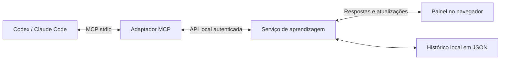

# Ateliê — MCP Tutor

Um MVP local de aprendizagem ativa. O tutor conversa no Codex, Claude Code ou outro cliente MCP; o aluno pratica em um painel no navegador. O tutor pode adicionar atividades durante a aula, ler as tentativas e devolver feedback.

**Ciclo da experiência:** prever → praticar → explicar → aplicar em outro contexto.

## Experimentar

Requer Node.js 22 ou superior. Na pasta do projeto:

```sh
npm install
npm start
```

Abra [o painel local](http://127.0.0.1:4317) e clique em **Abrir aula** ou **Nova aula de exemplo**. A aula “Sua primeira página” demonstra o ciclo completo com HTML. Seu roteiro é determinístico: não há um modelo de IA respondendo no modo exemplo. Explicações abertas ficam registradas, sem uma correção simulada.

O painel tem editor, prévia de HTML/CSS, perguntas, dicas graduais, diagramas com elementos selecionáveis, gráficos de barras, anotações e histórico de tentativas. Os rascunhos ficam no navegador; respostas enviadas, atividades e feedback ficam em `.data/sessions.json`.

## Conectar o tutor

Com o cliente correspondente instalado e disponível no terminal:

```sh
npm run setup:codex
# Ou:
npm run setup:claude
```

Esses comandos registram `mcp-tutor` no cliente usando o caminho absoluto do Node e do servidor, inclusive quando a pasta contém espaços. O Codex usa seu cadastro de servidores; o Claude Code usa escopo local ao projeto. Reinicie a conexão MCP ou abra uma nova conversa no cliente para carregar as ferramentas. O painel não se conecta a modelos nem precisa de uma chave de API própria: você usa a IA e a conta do cliente escolhido.

Comece com esta mensagem:

> Use o MCP Tutor para me ensinar a criar um site. Comece perguntando o que eu já sei, crie uma sessão e compartilhe o link do painel. Me dê uma atividade por vez. Espere minhas tentativas, ofereça dicas graduais e peça para eu explicar e depois recriar algo em um novo contexto.

O servidor MCP inicia o painel local automaticamente quando uma ferramenta é chamada, caso ele ainda não esteja rodando. Codex e Claude Code podem compartilhar o mesmo serviço e armazenamento. Para encerrar um painel iniciado manualmente, use Ctrl+C no terminal de `npm start`. Quando iniciado automaticamente pelo MCP, o processo continua disponível após a conversa; seu PID e a porta estão em `.data/runtime.json`. Encerre esse processo com SIGTERM se quiser fechá-lo.

**Atenção ao fluxo da conversa:** enviar uma tentativa ou mensagem no painel a deixa disponível para o tutor, mas não inicia um turno do modelo automaticamente. A ferramenta `tutor_get_events` pode aguardar até 25 segundos. Se o tutor já devolveu a vez, volte ao chat e diga **“Enviei minha tentativa; leia a sessão e me ajude com o próximo passo.”**

### Outro cliente MCP

Configure um servidor **stdio**, com:

```json
{
  "mcpServers": {
    "mcp-tutor": {
      "command": "/caminho/absoluto/para/node",
      "args": ["/caminho/absoluto/para/mcp tutor/src/mcp.js"]
    }
  }
}
```

O formato do arquivo externo varia por cliente; `command` e `args` acima representam os mesmos parâmetros usados pelos scripts de conexão. Para conferir os caminhos no seu computador: `command -v node` e `pwd`.

## Ferramentas MCP

| Ferramenta | Para que serve |
| --- | --- |
| `tutor_start_session` | Cria uma aula com objetivo e nível; retorna ID e URL. |
| `tutor_list_sessions` | Encontra aulas para retomar. |
| `tutor_get_session` | Lê atividades, respostas, raciocínio, confiança, dicas usadas e avaliações. |
| `tutor_add_block` | Acrescenta uma mensagem, pergunta, exercício, reflexão, diagrama ou gráfico. |
| `tutor_get_events` | Lê mudanças após um cursor, com espera opcional de até 25 segundos. |
| `tutor_review_attempt` | Registra uma avaliação do tutor sobre uma tentativa específica. |

Também são publicados o prompt `active_learning_tutor` e o recurso `tutor://guide`, com a orientação pedagógica. O servidor envia a mesma orientação na inicialização MCP. O cliente decide como disponibilizar prompts e recursos.

Exemplo do argumento de `tutor_add_block`:

```json
{
  "sessionId": "UUID retornado por tutor_start_session",
  "block": {
    "type": "code",
    "stage": "practice",
    "title": "Seu primeiro título",
    "prompt": "Crie uma região main com um título h1 e explique sua escolha.",
    "language": "html",
    "starterCode": "<main>\n\n</main>",
    "checks": [
      {
        "label": "Um título com conteúdo dentro de main",
        "selector": "main h1",
        "kind": "text_nonempty"
      }
    ],
    "hints": ["Pense no elemento que expressa o título principal."]
  }
}
```

Os contratos completos estão em `src/schema.js`. Os tipos atuais são `message`, `quiz`, `code`, `reflection`, `diagram` e `chart`. Etapas possíveis: `predict`, `practice`, `explain` e `transfer`. Verificações de código: `exists`, `text_nonempty`, `text_includes`, `text_equals` e `attribute_equals`. Diagramas usam nós e arestas com IDs; gráficos aceitam valores numéricos finitos e não negativos.

## Como funciona



- `src/mcp.js`: protocolo MCP, ferramentas, prompt e inicialização do serviço.
- `src/server.js`: API HTTP local, autenticação, arquivos do painel e eventos SSE.
- `src/store.js`: atividades, tentativas, avaliação objetiva, eventos e persistência.
- `src/schema.js`: contratos validados e orientação do tutor.
- `src/demo.js`: aula de exemplo, sem IA, usada para explorar a experiência.
- `public/`: interface em JavaScript e CSS, sem dependência de serviços externos.
- `test/`: testes de domínio e integração pelo SDK MCP real.
- `docs/product.md`: decisões de produto e próximos incrementos sugeridos.

Há uma única instância de serviço por diretório de dados. As escritas são serializadas e salvas com substituição atômica do arquivo. Não execute serviços diferentes apontando para o mesmo diretório: o MVP não possui coordenação de armazenamento entre processos.

## Limites desta versão

- **HTML/CSS apenas na prévia.** JavaScript, Python, processos do sistema e testes arbitrários não são executados. Outras linguagens podem ser discutidas em perguntas abertas, sem executor.
- **Verificação não é domínio.** Os testes de HTML checam a estrutura do documento; não avaliam a aparência, a qualidade do raciocínio ou a aprendizagem. A avaliação do tutor é apresentada separadamente e preserva o resultado automático.
- **Interface no navegador.** Este MVP não implementa a extensão MCP Apps para atividades dentro do chat. O suporte a essa extensão varia por cliente; o painel local permite experimentar o núcleo sem depender dela.
- **Uso local.** Sem login de usuários, sincronização na nuvem, publicação ou compartilhamento. As sessões locais ficam disponíveis para o tutor conectado; não há isolamento por cliente ou pessoa.
- **O tutor decide a próxima etapa.** As descrições das ferramentas e o prompt orientam o comportamento pedagógico, mas não impedem que um modelo responda inadequadamente. Avaliações de qualidade do tutor são um próximo trabalho.
- **A retomada exige o cliente de IA.** Eventos do painel não disparam conversas por conta própria.

O serviço escuta somente em `127.0.0.1`, valida Host e Origin, exige um cookie local ou token de conexão e não habilita CORS. A prévia usa iframe com sandbox, scripts desabilitados e política que bloqueia recursos de rede. O código enviado é analisado como HTML; nunca é executado no Node. O token de conexão fica em `.data/runtime.json` com permissão restrita. `.data/` está fora do Git.

## Desenvolvimento e verificação

```sh
npm run check
npm test
```

Os testes cobrem: percurso completo da aula, comentários que não devem satisfazer verificações, respostas vazias, dicas e respostas de quiz ocultas, preservação da avaliação automática, espera de eventos, persistência, escritas concorrentes, validação de contratos, autenticação local e integração real MCP → atividade → tentativa → avaliação. O teste de integração usa uma porta temporária e um diretório em `/tmp`, sem tocar nas aulas do usuário.

Para outra instância independente, configure **as duas variáveis** no serviço e no adaptador MCP:

```sh
TUTOR_PORT=4318 TUTOR_DATA_DIR=/tmp/meu-tutor npm start
```

Se a porta estiver ocupada, confira primeiro se o painel já está rodando. Não apague o histórico para resolver falhas de conexão. Um arquivo de dados ilegível causa erro explícito e é preservado.

## Referências de integração

Documentação consultada em 9 de setembro de 2026:

- [MCP no Codex](https://learn.chatgpt.com/docs/extend/mcp?surface=cli): configuração de transportes stdio e HTTP.
- [MCP no Claude Code](https://code.claude.com/docs/en/mcp): registro de servidores locais e escopos.
- [SDK TypeScript oficial do MCP, linha v1](https://github.com/modelcontextprotocol/typescript-sdk/tree/v1.x): servidor e cliente usados nesta versão.
- [MCP Apps](https://modelcontextprotocol.io/extensions/apps/overview): extensão para interfaces interativas em clientes compatíveis.
