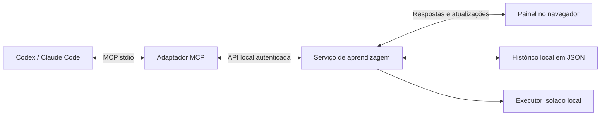

# Ateliê — MCP Tutor

Um MVP local de aprendizagem ativa. O tutor conversa no Codex, Claude Code ou outro cliente MCP; o aluno pratica em um painel no navegador. O tutor pode adicionar atividades durante a aula, ler as tentativas e devolver feedback.

**Ciclo da experiência:** entender → prever → praticar → explicar → aplicar em outro contexto → revisar depois.

## Experimentar

Requer Node.js 22 ou superior. Para executar programas, esta versão usa **Linux, Bubblewrap, Python 3 e libseccomp**. Python é necessário também para preparar o ambiente isolado. Java (JDK), GCC e G++ são opcionais; o painel detecta o que está disponível em `/usr/bin`, `/usr/local/bin` ou `/bin` com destino em `/usr`. Na pasta do projeto:

```sh
npm install
npm start
```

Abra [o painel local](http://127.0.0.1:4317). Escolha uma aula de **HTML, Python ou Java**, ou entre no **Laboratório** para experimentar Python, Java, JavaScript, C e C++. Os exemplos usam roteiros determinísticos: não há um modelo de IA respondendo no modo exemplo. Explicações abertas ficam registradas, sem uma correção simulada.

O painel tem teoria curta com exemplos comentados, editor, entrada de dados, console, prévia de HTML/CSS, perguntas, dicas graduais, diagramas, gráficos e histórico de tentativas. Os rascunhos ficam no navegador; respostas enviadas, atividades, feedback e revisões ficam em `.data/sessions.json`. Aulas da versão anterior são preservadas.

### Laboratório e revisões

No **Laboratório**, escolha a linguagem, escreva um programa e informe os valores de entrada, um por linha. Use **Executar código** ou Ctrl/Cmd+Enter. O console apresenta saída, erros e duração; **Parar** cancela a execução. Java usa um arquivo `Main.java` com `public class Main`. JavaScript roda em Node, sem DOM do navegador. Cada execução começa em uma pasta temporária nova.

Nas aulas, **Executar** serve para experimentar; **Enviar tentativa** roda os casos de teste definidos pelo tutor e registra código, raciocínio e resultados. A entrada desses testes pode ser diferente da usada na sua experiência livre.

Em **Revisões**, responda de memória antes de revelar a referência. Depois, compare e registre sua autoavaliação. O aplicativo agenda a próxima revisão usando intervalos de 1, 3, 7, 14 ou 30 dias, como uma heurística inicial ajustável — não como um calendário cientificamente ótimo. As revisões aparecem no painel, sem notificações externas. Consulte a [orientação pedagógica](docs/pedagogy.md).

## Conectar o tutor

Com o cliente correspondente instalado e disponível no terminal:

```sh
npm run setup:codex
# Ou:
npm run setup:claude
```

Esses comandos registram `mcp-tutor` no cliente usando o caminho absoluto do Node e do servidor, inclusive quando a pasta contém espaços. O Codex usa seu cadastro de servidores; o Claude Code usa escopo local ao projeto. Reinicie a conexão MCP ou abra uma nova conversa no cliente para carregar as ferramentas. O painel não se conecta a modelos nem precisa de uma chave de API própria: você usa a IA e a conta do cliente escolhido.

Comece com esta mensagem:

> Use o MCP Tutor para me ensinar a criar um site. Comece perguntando o que eu já sei, crie uma sessão e compartilhe o link do painel. Me dê uma atividade por vez. Espere minhas tentativas, ofereça dicas graduais e peça para eu explicar e depois recriar algo em um novo contexto.

O servidor MCP inicia o painel local automaticamente quando uma ferramenta é chamada, caso ele ainda não esteja rodando. Codex e Claude Code podem compartilhar o mesmo serviço e armazenamento. Para encerrar um painel iniciado manualmente, use Ctrl+C no terminal de `npm start`. Quando iniciado automaticamente pelo MCP, o processo continua disponível após a conversa; seu PID e a porta estão em `.data/runtime.json`. Encerre esse processo com SIGTERM se quiser fechá-lo.

**Atenção ao fluxo da conversa:** enviar uma tentativa ou mensagem no painel a deixa disponível para o tutor, mas não inicia um turno do modelo automaticamente. A ferramenta `tutor_get_events` pode aguardar até 25 segundos. Se o tutor já devolveu a vez, volte ao chat e diga **“Enviei minha tentativa; leia a sessão e me ajude com o próximo passo.”**

### Outro cliente MCP

Configure um servidor **stdio**, com:

```json
{
  "mcpServers": {
    "mcp-tutor": {
      "command": "/caminho/absoluto/para/node",
      "args": ["/caminho/absoluto/para/mcp tutor/src/mcp.js"]
    }
  }
}
```

O formato do arquivo externo varia por cliente; `command` e `args` acima representam os mesmos parâmetros usados pelos scripts de conexão. Para conferir os caminhos no seu computador: `command -v node` e `pwd`.

## Ferramentas MCP

| Ferramenta | Para que serve |
| --- | --- |
| `tutor_start_session` | Cria uma aula com objetivo e nível; retorna ID e URL. |
| `tutor_list_sessions` | Encontra aulas para retomar. |
| `tutor_get_session` | Lê atividades, respostas, raciocínio, confiança, dicas usadas e avaliações. |
| `tutor_add_block` | Acrescenta uma mensagem, pergunta, exercício, reflexão, diagrama ou gráfico. |
| `tutor_get_events` | Lê mudanças após um cursor, com espera opcional de até 25 segundos. |
| `tutor_review_attempt` | Registra uma avaliação do tutor sobre uma tentativa específica. |
| `tutor_list_runtimes` | Detecta linguagens, versões e disponibilidade do isolamento. |
| `tutor_run_code` | Executa um programa isolado, com entrada e limites; não registra uma tentativa de aluno. |
| `tutor_schedule_review` | Agenda uma pergunta de recuperação com referência para comparação. |
| `tutor_get_reviews` | Lê revisões, tentativas de recuperação e autoavaliações. |

Também são publicados o prompt `active_learning_tutor` e o recurso `tutor://guide`, com a orientação pedagógica. O servidor envia a mesma orientação na inicialização MCP. O cliente decide como disponibilizar prompts e recursos.

Exemplo do argumento de `tutor_add_block`:

```json
{
  "sessionId": "UUID retornado por tutor_start_session",
  "block": {
    "type": "code",
    "stage": "practice",
    "title": "Seu primeiro título",
    "prompt": "Crie uma região main com um título h1 e explique sua escolha.",
    "language": "html",
    "starterCode": "<main>\n\n</main>",
    "checks": [
      {
        "label": "Um título com conteúdo dentro de main",
        "selector": "main h1",
        "kind": "text_nonempty"
      }
    ],
    "hints": ["Pense no elemento que expressa o título principal."]
  }
}
```

Para um exercício executável, use por exemplo:

```json
{
  "sessionId": "UUID retornado por tutor_start_session",
  "block": {
    "type": "code",
    "stage": "practice",
    "title": "Transforme uma entrada",
    "prompt": "Leia um inteiro e imprima seu triplo. Explique como o texto recebido vira um número.",
    "language": "python",
    "starterCode": "numero = int(input())\n# Complete a transformação\n",
    "stdin": "4\n",
    "tests": [
      { "name": "Inteiro positivo", "stdin": "4\n", "expectedStdout": "12\n" },
      { "name": "Inteiro negativo", "stdin": "-2\n", "expectedStdout": "-6\n" }
    ],
    "hints": ["Qual operação representa três vezes a mesma quantidade?"]
  }
}
```

Os contratos completos estão em `src/schema.js`. Tipos: `message`, `lesson`, `quiz`, `code`, `reflection`, `diagram` e `chart`. Etapas: `learn`, `predict`, `practice`, `explain`, `transfer` e `review`. `lesson` aceita texto, ideias principais e exemplo comentado. Sessões podem declarar objetivos e tempo estimado. HTML usa verificações de estrutura (`checks`); as outras linguagens usam casos de entrada e saída (`tests`). A comparação normaliza quebras de linha e ignora espaços no fim da saída; o restante precisa corresponder. Cada caso executa o código novamente em um ambiente novo. Diagramas usam nós e arestas com IDs; gráficos aceitam valores finitos e não negativos.

## Como funciona



- `src/mcp.js`: protocolo MCP, ferramentas, prompt e inicialização do serviço.
- `src/server.js`: API HTTP local, autenticação, arquivos do painel e eventos SSE.
- `src/store.js`: atividades, tentativas, avaliação objetiva, eventos e persistência.
- `src/schema.js`: contratos validados e orientação do tutor.
- `src/demo.js` e `src/programming-demos.js`: aulas de HTML, Python e Java, sem IA.
- `src/runner.js` e `src/runner-launcher.py`: descoberta de linguagens, isolamento, execução e limites.
- `src/learning.js`: indicadores de tentativas e intervalos de revisão.
- `public/`: interface em JavaScript e CSS, sem dependência de serviços externos.
- `test/`: testes de domínio, execução real e integração pelo SDK MCP.
- `docs/product.md`: decisões de produto e próximos incrementos sugeridos.

Há uma única instância de serviço por diretório de dados. As escritas são serializadas e salvas com substituição atômica do arquivo. Não execute serviços diferentes apontando para o mesmo diretório: o MVP não possui coordenação de armazenamento entre processos.

## Limites desta versão

- **Execução local em Linux.** Um arquivo por programa, com entrada fornecida de uma vez. Sem terminal interativo, interfaces gráficas, rede, pacotes de projeto, ambientes virtuais ou acesso às pastas do usuário. O executor não aceita comandos de shell nem caminhos de executáveis fornecidos pelo aluno. A prévia HTML continua sem scripts.
- **Limites por execução.** Até 10 segundos incluindo compilação, 32 KiB de saída combinada, 1.536 MiB de memória virtual por processo, dois programas simultâneos e arquivos temporários limitados. JVM e Node recebem limites adicionais. Threads são permitidas para os runtimes; novos processos do programa são bloqueados. Os detalhes estão no código do executor.
- **Verificação não é domínio.** Testes de HTML checam a estrutura; testes das demais linguagens comparam comportamento nos casos fornecidos. Não avaliam aparência, raciocínio ou aprendizagem. A avaliação do tutor é apresentada separadamente e preserva o resultado automático. Confiança e autoavaliação de revisões são relatos do aluno.
- **Interface no navegador.** Este MVP não implementa a extensão MCP Apps para atividades dentro do chat. O suporte a essa extensão varia por cliente; o painel local permite experimentar o núcleo sem depender dela.
- **Uso local.** Sem login de usuários, sincronização na nuvem, publicação ou compartilhamento. As sessões locais ficam disponíveis para o tutor conectado; não há isolamento por cliente ou pessoa.
- **O tutor decide a próxima etapa.** As descrições das ferramentas e o prompt orientam o comportamento pedagógico, mas não impedem que um modelo responda inadequadamente. Avaliações de qualidade do tutor são um próximo trabalho.
- **A retomada exige o cliente de IA.** Eventos do painel não disparam conversas por conta própria.

O serviço escuta somente em `127.0.0.1`, valida Host e Origin, exige um cookie local ou token de conexão e não habilita CORS. A prévia usa iframe com sandbox e bloqueia scripts e recursos de rede. Os programas rodam em processos separados com namespaces do Bubblewrap, sistema de arquivos restrito, ambiente limpo, limites do sistema e filtro seccomp. Se o isolamento não estiver disponível, a execução é desabilitada; não há alternativa sem isolamento. Esse mecanismo reduz a superfície de acesso, mas não é uma VM nem uma garantia contra falhas do kernel ou do runtime. O token de conexão fica em `.data/runtime.json` com permissão restrita. `.data/` está fora do Git.

## Desenvolvimento e verificação

```sh
npm run check
npm test
```

Os testes cobrem aulas completas, migração e persistência, revisão sem revelar a referência antes da tentativa, intervalos, casos de entrada/saída, execução real nas cinco linguagens, erros, laços infinitos, cancelamento, concorrência, limites e bloqueio de acesso a arquivos do host, rede e criação de processos. Também verificam contratos, autenticação e o fluxo MCP → atividade → tentativa → avaliação. As suítes usam dados temporários, sem alterar as aulas do usuário. A suíte do executor exige isolamento funcional e Python 3. Casos de linguagens opcionais não instaladas são pulados com motivo explícito; confira o total de testes pulados. Nesta máquina, os 26 testes passaram, sem casos pulados, incluindo as cinco linguagens.

Para outra instância independente, configure **as duas variáveis** no serviço e no adaptador MCP:

```sh
TUTOR_PORT=4318 TUTOR_DATA_DIR=/tmp/meu-tutor npm start
```

Se a porta estiver ocupada, confira primeiro se o painel já está rodando. Não apague o histórico para resolver falhas de conexão. Um arquivo de dados ilegível causa erro explícito e é preservado.

Se o Laboratório indicar isolamento indisponível, confira os pacotes `bubblewrap` e `libseccomp2`, Python 3 e a permissão do sistema para namespaces sem privilégios. Restrições do ambiente em que o servidor foi iniciado também podem bloquear o Bubblewrap. Não desative as proteções do host para contornar o erro: use uma configuração Linux compatível. Após instalar runtimes ou atualizar este projeto, reinicie o serviço local; para carregar novas ferramentas, reconecte também o cliente MCP.

## Referências de integração

Documentação consultada em 9 de setembro de 2026:

- [MCP no Codex](https://learn.chatgpt.com/docs/extend/mcp?surface=cli): configuração de transportes stdio e HTTP.
- [MCP no Claude Code](https://code.claude.com/docs/en/mcp): registro de servidores locais e escopos.
- [SDK TypeScript oficial do MCP, linha v1](https://github.com/modelcontextprotocol/typescript-sdk/tree/v1.x): servidor e cliente usados nesta versão.
- [MCP Apps](https://modelcontextprotocol.io/extensions/apps/overview): extensão para interfaces interativas em clientes compatíveis.
