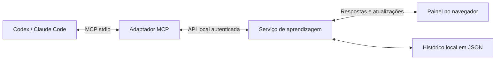

# Ateliê — MCP Tutor

Um MVP local de aprendizagem ativa. O tutor conversa no Codex, Claude Code ou outro cliente MCP; o aluno pratica em um painel no navegador. O tutor pode adicionar atividades durante a aula, ler as tentativas e devolver feedback.

**Versão documentada: 0.4.** Esta revisão mantém o produto em 0.4; as decisões abaixo não criam uma versão 0.5.

**Ciclo da experiência:** prever → praticar → explicar → aplicar em outro contexto.

## Experimentar

Requer Node.js 22 ou superior. Na pasta do projeto:

```sh
npm install
npm start
```

Abra [o painel local](http://127.0.0.1:4317) e clique em **Abrir aula** para explorar o exemplo determinístico ou em **Nova conversa** para iniciar uma aula com o agente. A aula “Sua primeira página” demonstra o ciclo completo com HTML. No modo exemplo não há um modelo de IA respondendo; explicações abertas ficam registradas, sem uma correção simulada.

Para uma primeira execução reproduzível, siga o [guia operacional](docs/operations.md). Ele cobre pré-requisitos, conexão do cliente de IA, rotina de uma aula e recuperação de falhas. Antes de considerar uma instalação saudável, execute `npm run quality` e `npm run doctor`. Use `npm run backup` antes de atualizações para criar uma cópia validada e versionada do histórico local.

O painel tem editor, prévia de HTML/CSS, perguntas, dicas graduais, diagramas com elementos selecionáveis e gráficos de barras. Notas do aluno são privadas, ficam em `localStorage` por sessão e não são enviadas ao tutor; tentativas, atividades e feedback ficam no histórico local da sessão. Materiais e histórico aparecem fora do transcript do chat, nas superfícies próprias do painel. A arquitetura e os limites de cada processo estão descritos em [docs/architecture.md](docs/architecture.md).

Em telas largas, o painel usa três superfícies: **Aulas** à esquerda, um **chat central amplo** e **Estudo** à direita. Estudo tem as abas **Atividade**, **Dicas**, **Notas** e **Plano**. Em telas pequenas, Estudo sai do fluxo principal e é aberto por um drawer acionado pelo botão **Estudo**. O chat continua dedicado à conversa; materiais, atividade, dicas, notas e histórico não são despejados no transcript.

Arraste a divisória entre o chat e Estudo para aumentar o espaço de leitura ou de código. A largura é lembrada neste navegador; as setas esquerda/direita também ajustam o divisor quando ele recebe foco, e dois cliques restauram o padrão. O conteúdo do chat ocupa a largura disponível, sem o antigo limite central fixo.

Ao clicar em **Começar aula**, o objetivo e o nível do formulário já iniciam a conversa com Luna: o plano e a primeira mini-lição são preparados automaticamente. Não é necessário repetir o pedido no chat. O tutor deve explicar um conceito e mostrar um exemplo resolvido antes de propor uma tarefa. A primeira resposta fica reservada ao ensino; depois, você pode tirar dúvidas ou pedir para praticar. A abertura não altera aulas antigas nem inicia automaticamente aulas criadas por um cliente MCP externo.

Quando o agente estiver respondendo, o painel acompanha status e fases legíveis da operação: conexão, raciocínio, leitura da sessão, criação de atividade, revisão da tentativa, avanço da etapa, finalização, falha ou cancelamento. Uma mensagem do aluno é salva antes da resposta, portanto a sessão pode ser retomada mesmo se o agente falhar ou for cancelado.

### Chat integrado

O botão **Nova conversa** cria uma sessão diretamente no painel. Em uma sessão conduzida pelo tutor, cada mensagem enviada em **Converse com seu tutor** é gravada e encaminhada ao backend do agente; a resposta volta para o histórico da conversa. O backend da v0.4 usa obrigatoriamente o modelo `gpt-5.6-luna`, em modo efêmero e com sandbox `read-only`, ignora configurações pessoais de plugins/MCPs e injeta somente o MCP Tutor. Não existe override de modelo por variável de ambiente: qualquer override deve ser ignorado. Defina `TUTOR_AGENT=none` para deixar apenas o modo manual MCP.

O chat automático da v0.4 é um backend específico do contrato do agente Luna. `npm run setup:claude` configura o Claude Code como cliente MCP externo para conduzir a aula no próprio chat, mas não promete que o executável `claude` funcione como backend do chat do navegador.

O chat integrado requer o backend do agente disponível localmente; `npm run setup:codex` é necessário quando você quer usar o MCP Tutor diretamente em uma conversa externa do Codex. O agente recebe o estado da sessão como contexto e deve tratar mensagens, respostas e código do aluno como dados não confiáveis. O painel não envia o código do aluno para um executor Node; a execução JavaScript continua restrita ao Web Worker do navegador.

O status exibido pelo painel informa configuração e estado operacional, mas não comprova autenticação. A autenticação e a disponibilidade só podem ser confirmadas pelo resultado de uma chamada real. A v0.4 não promete streaming token-a-token: o painel mostra fases/status durante o processamento e recebe a resposta textual final.

O status por sessão é consultado em `GET /api/agent?sessionId=…` e retorna `session` com `phase`, `active`, `lastError`, `startedAt`, `updatedAt` e `elapsedSeconds`. Para cancelar, use `POST /api/sessions/:id/chat/cancel` com corpo `{}`. Para repetir a última mensagem sem criar outra cópia, use `POST /api/sessions/:id/chat` com `{ "retry": true }`. Quando o agente conclui, `phase: "completed"` indica a conclusão do agente; a mensagem `tutorMessage` é salva logo depois.

No chat integrado, o envio de uma tentativa dispara uma solicitação de revisão automaticamente quando o tutor está habilitado e não há resposta ativa para a sessão. Se isso não for possível, a tentativa continua salva e o aluno pede a revisão ao terminar. Cancelar não desfaz atividades, revisões ou avanços MCP já realizados.

## Conectar o tutor

Com o cliente correspondente instalado e disponível no terminal:

```sh
npm run setup:codex
# Ou:
npm run setup:claude
```

Esses comandos registram `mcp-tutor` no cliente usando o caminho absoluto do Node e do servidor, inclusive quando a pasta contém espaços. O Codex usa seu cadastro de servidores; o Claude Code usa escopo local ao projeto. Reinicie a conexão MCP ou abra uma nova conversa no cliente para carregar as ferramentas. O chat integrado usa a conexão local do backend do agente; o status de configuração não substitui uma chamada bem-sucedida e não há uma chave de API própria do MCP Tutor.

Há dois modos de uso que não devem ser confundidos:

- **Cliente MCP externo:** Codex, Claude Code ou outro cliente conversa com o tutor e chama as ferramentas MCP. Esse é o caminho de integração documentado para Codex e Claude Code.
- **Chat no navegador:** o painel chama localmente o backend Luna, sempre com `gpt-5.6-luna`. A configuração MCP do Claude Code, por si só, não habilita esse chat automático.

Comece com esta mensagem:

> Use o MCP Tutor para me ensinar a criar um site. Comece perguntando o que eu já sei, crie uma sessão e compartilhe o link do painel. Me dê uma atividade por vez. Espere minhas tentativas, ofereça dicas graduais e peça para eu explicar e depois recriar algo em um novo contexto.

O servidor MCP inicia o painel local automaticamente quando uma ferramenta é chamada, caso ele ainda não esteja rodando. Codex e Claude Code podem compartilhar o mesmo serviço e armazenamento. Para encerrar um painel iniciado manualmente, use Ctrl+C no terminal de `npm start`. Quando iniciado automaticamente pelo MCP, o processo continua disponível após a conversa; seu PID e a porta estão em `.data/runtime.json`. Encerre esse processo com SIGTERM se quiser fechá-lo.

**Atenção ao fluxo da conversa:** no chat integrado, enviar uma mensagem chama o backend Luna e a resposta aparece na mesma sessão; o aluno pode cancelar uma resposta em andamento e tentar novamente. O envio de uma tentativa também tenta iniciar a revisão no chat quando o tutor está habilitado e livre. Em um cliente MCP externo, enviar uma tentativa ou mensagem apenas deixa o conteúdo disponível para o tutor; nesse caso, a ferramenta `tutor_get_events` pode aguardar até 25 segundos e você pode voltar ao chat dizendo **“Enviei minha tentativa; leia a sessão e me ajude com o próximo passo.”**

### Outro cliente MCP

Configure um servidor **stdio**, com:

```json
{
  "mcpServers": {
    "mcp-tutor": {
      "command": "/caminho/absoluto/para/node",
      "args": ["/caminho/absoluto/para/mcp tutor/src/mcp.js"]
    }
  }
}
```

O formato do arquivo externo varia por cliente; `command` e `args` acima representam os mesmos parâmetros usados pelos scripts de conexão. Para conferir os caminhos no seu computador: `command -v node` e `pwd`.

## Ferramentas MCP

| Ferramenta | Para que serve |
| --- | --- |
| `tutor_start_session` | Cria uma aula com objetivo e nível; retorna ID e URL. |
| `tutor_list_sessions` | Encontra aulas para retomar. |
| `tutor_get_session` | Lê atividades, respostas, raciocínio, confiança, dicas usadas e avaliações. |
| `tutor_add_block` | Acrescenta uma mensagem, pergunta, exercício, reflexão, diagrama ou gráfico. |
| `tutor_get_events` | Lê mudanças após um cursor, com espera opcional de até 25 segundos. |
| `tutor_review_attempt` | Registra uma avaliação do tutor sobre uma tentativa específica. |
| `tutor_advance_stage` | Avança explicitamente uma etapa quando uma tentativa demonstra o objetivo. |

Também são publicados o prompt `active_learning_tutor` e o recurso `tutor://guide`, com a orientação pedagógica. O servidor envia a mesma orientação na inicialização MCP. O cliente decide como disponibilizar prompts e recursos.

### Estado da aula

As etapas seguem `predict → practice → explain → transfer`. O serviço permite apenas uma atividade respondível aberta por vez (`quiz`, `code` ou `reflection`). Tentativas que precisam de trabalho mantêm o aluno na mesma etapa; uma tentativa aprovada libera o estado `ready_for_transition`, mas o tutor ainda precisa chamar `tutor_advance_stage` com a tentativa mais recente e uma justificativa baseada em evidência. Mensagens, diagramas e gráficos podem apoiar a etapa atual sem abrir outra atividade respondível.

O estado visível da sessão inclui `progress.stage`, `progress.status`, `progress.activeBlockId`, `progress.lastAttemptId` e `progress.completedStages`. O contrato detalhado está em [`docs/state-machine.md`](docs/state-machine.md).

Exemplo do argumento de `tutor_add_block`:

```json
{
  "sessionId": "UUID retornado por tutor_start_session",
  "block": {
    "type": "code",
    "stage": "practice",
    "title": "Seu primeiro título",
    "prompt": "Crie uma região main com um título h1 e explique sua escolha.",
    "language": "html",
    "starterCode": "<main>\n\n</main>",
    "checks": [
      {
        "label": "Um título com conteúdo dentro de main",
        "selector": "main h1",
        "kind": "text_nonempty"
      }
    ],
    "hints": ["Pense no elemento que expressa o título principal."]
  }
}
```

Quando a tentativa demonstrar o objetivo, avance uma etapa explicitamente:

```json
{
  "sessionId": "UUID da sessão",
  "attemptId": "UUID da tentativa mais recente",
  "reason": "A tentativa contém a estrutura pedida e o raciocínio explica a escolha."
}
```

Esse é o argumento de `tutor_advance_stage`. Se a sessão ainda estiver aguardando tentativa ou revisão, o serviço rejeita a transição.

Atividades `code` podem usar `language: "html"` ou `language: "javascript"`. HTML usa `checks` estruturais e aparece em uma prévia sem scripts; JavaScript usa `tests` com expressões booleanas e pode ser executado pelo aluno no sandbox do painel. O resultado JavaScript é salvo como evidência `pending_review`, para o tutor avaliar junto com o código e, quando informado, o raciocínio complementar. Exemplo:

```json
{
  "sessionId": "UUID retornado por tutor_start_session",
  "block": {
    "type": "code",
    "stage": "practice",
    "title": "Uma função que transforma texto",
    "prompt": "Crie uma função upperCase que receba um texto e devolva sua versão em maiúsculas.",
    "language": "javascript",
    "starterCode": "function upperCase(text) {\n  // escreva sua solução\n}",
    "tests": [
      { "label": "A função existe", "expression": "typeof upperCase === 'function'" },
      { "label": "Transforma o texto", "expression": "upperCase('oi') === 'OI'" }
    ],
    "hints": ["Comece pensando em qual operação de string já faz essa transformação."]
  }
}
```

As expressões em `tests` são fornecidas pelo tutor e avaliadas no Worker dedicado `/exercise-worker.js`, não no servidor. A resposta desse Worker é apenas evidência do navegador e não é confiável por si só: o tutor deve revisá-la, e não há promessa de isolamento absoluto contra código hostil. Os contratos completos estão em `src/schema.js`. Os tipos atuais são `message`, `quiz`, `code`, `reflection`, `diagram` e `chart`. Etapas possíveis: `predict`, `practice`, `explain` e `transfer`. Verificações HTML: `exists`, `text_nonempty`, `text_includes`, `text_equals` e `attribute_equals`. Diagramas usam nós e arestas com IDs; gráficos aceitam valores numéricos finitos e não negativos.

## Como funciona



- `src/mcp.js`: protocolo MCP, ferramentas, prompt e inicialização do serviço.
- `src/server.js`: API HTTP local, autenticação, arquivos do painel e eventos SSE.
- `src/store.js`: atividades, tentativas, máquina de estados, avaliação objetiva, eventos e persistência.
- `src/schema.js`: contratos validados e orientação do tutor.
- `src/demo.js`: aula de exemplo, sem IA, usada para explorar a experiência.
- `public/`: interface em JavaScript e CSS, sem dependência de serviços externos.
- `src/agent.js`: ponte opcional entre o chat do painel e um agente CLI, com contexto de sessão e timeout.
- `test/`: testes de domínio e integração pelo SDK MCP real.
- `docs/product.md`: decisões de produto e escopo da versão 0.4.
- `docs/agent-bridge.md`: fluxo, configuração e limites do chat integrado.
- `docs/architecture.md`: componentes, fluxos, dados e fronteiras de confiança.
- `docs/operations.md`: procedimento de instalação, uso diário, backup e troubleshooting.
- `docs/release-readiness.md`: crítica de maturidade, critérios de pronto e roadmap priorizado.
- `docs/validation-v0.4.md`: registro datado das evidências observadas e pendências da v0.4.

Há uma única instância de serviço por diretório de dados. As escritas são serializadas e salvas com substituição atômica do arquivo. Não execute serviços diferentes apontando para o mesmo diretório: o MVP não possui coordenação de armazenamento entre processos.

## Limites desta versão

- **Execução delimitada.** HTML/CSS aparece em prévia sem scripts ou rede. JavaScript roda em `/exercise-worker.js`, um Worker dedicado com limite de 1,5 segundo e `connect-src 'none'`; a CSP da página principal mantém `script-src 'self'` sem `unsafe-eval` e `worker-src 'self'` sem `blob:`. O asset do Worker tem CSP própria `default-src 'none'; script-src 'unsafe-eval'; connect-src 'none'; worker-src 'none'` para permitir `Function` somente dentro dele. Essa fronteira reduz o alcance do exercício, mas não é isolamento absoluto; checks e saída do browser continuam evidência não confiável. Python e processos do sistema não são executados.
- **Verificação não é domínio.** Os testes de HTML checam a estrutura do documento e os testes de JavaScript checam apenas as expressões configuradas; nenhum deles avalia a aparência, a qualidade do raciocínio ou a aprendizagem. A avaliação do tutor é apresentada separadamente e preserva a evidência automática.
- **Interface no navegador.** A v0.4 define chat central amplo, Aulas à esquerda, Estudo à direita e drawer de Estudo em telas pequenas. Este MVP ainda não implementa uma extensão MCP Apps empacotada para renderizar atividades dentro de chats de terceiros; o suporte varia por cliente.
- **Uso local.** Sem login de usuários, sincronização na nuvem, publicação ou compartilhamento. As sessões locais ficam disponíveis para o tutor conectado; não há isolamento por cliente ou pessoa.
- **A máquina não substitui o tutor.** O serviço garante ordem, atividade única e evidência mínima para a transição, mas o tutor continua responsável pela qualidade pedagógica da explicação, da rubrica e da adaptação de dificuldade.
- **Agente e retomada.** O backend Luna expõe status da sessão, cancelamento idempotente e retomada sem duplicar mensagens. Eventos do painel não disparam conversas por conta própria em clientes MCP externos.

## Prontidão de entrega

O produto está em nível de **MVP utilizável para piloto local individual**: o percurso de prática funciona, as sessões persistem e há integração MCP testada. Ainda não deve ser tratado como serviço público, produto multiusuário ou ambiente seguro para código não confiável em escala. Faltam, entre outros pontos, contas e isolamento de dados, backup/restore assistido, telemetria, recuperação de processos do agente, limites operacionais mais completos e uma extensão MCP Apps empacotada.

Use [docs/release-readiness.md](docs/release-readiness.md) para decidir se uma mudança está pronta e [docs/operations.md](docs/operations.md) para colocar uma instalação local em uso. O roadmap prioriza confiabilidade e segurança operacional antes de ampliar linguagens ou interfaces.

O serviço escuta somente em `127.0.0.1`, valida Host e Origin, exige um cookie local ou token de conexão e não habilita CORS. A prévia HTML usa iframe com sandbox, scripts desabilitados e política que bloqueia recursos de rede. O executor JavaScript usa um Web Worker descartável, com APIs de rede desabilitadas, política de conteúdo e timeout que consegue interromper loops infinitos; ele não tem acesso ao DOM, ao Node, ao terminal ou ao sistema de arquivos. O código enviado nunca é executado no servidor. O token de conexão fica em `.data/runtime.json` com permissão restrita. `.data/` está fora do Git.

## Desenvolvimento e verificação

```sh
npm run check
npm test
```

Os testes cobrem: percurso completo da aula, máquina de estados e transições inválidas, atividade única, retry, revisão de reflexões, comentários que não devem satisfazer verificações, respostas vazias, dicas e respostas de quiz ocultas, preservação da avaliação automática, espera de eventos, persistência, escritas concorrentes, validação de contratos, autenticação local e integração real MCP → atividade → tentativa → avaliação → avanço. O teste de integração usa uma porta temporária e um diretório em `/tmp`, sem tocar nas aulas do usuário.

Consulte o [registro de validação da v0.4](docs/validation-v0.4.md) para a evidência observada em 2026-09-10. O registro é parcial: não marca a reflection em andamento nem os demais critérios como concluídos e não promete segurança ou release público.

Para outra instância independente, configure **as duas variáveis** no serviço e no adaptador MCP:

```sh
TUTOR_PORT=4318 TUTOR_DATA_DIR=/tmp/meu-tutor npm start
```

Se a porta estiver ocupada, confira primeiro se o painel já está rodando. Não apague o histórico para resolver falhas de conexão. Um arquivo de dados ilegível causa erro explícito e é preservado.

## Referências de integração

Documentação consultada em 9 de setembro de 2026:

- [MCP no Codex](https://learn.chatgpt.com/docs/extend/mcp?surface=cli): configuração de transportes stdio e HTTP.
- [MCP no Claude Code](https://code.claude.com/docs/en/mcp): registro de servidores locais e escopos.
- [SDK TypeScript oficial do MCP, linha v1](https://github.com/modelcontextprotocol/typescript-sdk/tree/v1.x): servidor e cliente usados nesta versão.
- [MCP Apps](https://modelcontextprotocol.io/extensions/apps/overview): extensão para interfaces interativas em clientes compatíveis.
